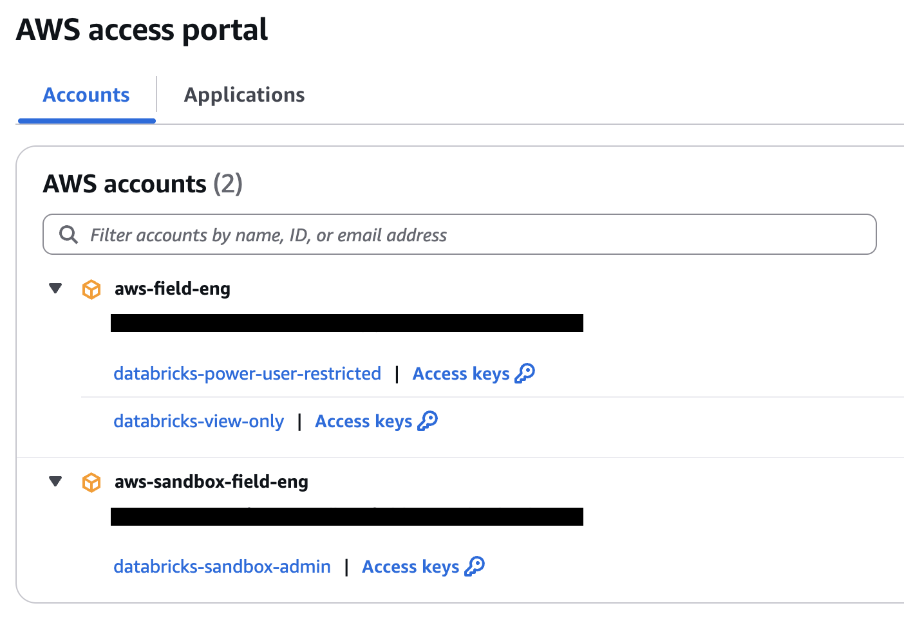

# Configure Access

## AWS SSO

In the "AWS access portal" which lists all all the accounts that can be accessed, the SSO sign-in info along with other very useful secrets can be found via the `Access keys` link.



Use `aws configure sso` and provide the following which can be found in `Access keys`

Provide the following:
```
SSO session name (Recommended): aws-sandbox-field-eng
SSO start URL [None]: https://d-92670d081f.awsapps.com/start/#
SSO region [None]: us-west-2
SSO registration scopes [sso:account:access]: <Leave blank>

Select aws-sandbox-field-eng, aws-sandbox-field-eng@databricks.com (332745928618)
The only role available to you is: databricks-sandbox-admin

Default client Region [None]: eu-west-2
CLI default output format (json if not specified) [None]: <Leave blank>
Profile name [databricks-sandbox-admin-332745928618]: <Leave blank>
```

The credentials will be saved in `~/.aws/config`.

## Refresh Access

The SSO token retrieved from `aws configure sso` will expire. To refresh it, use `aws sso login --profile databricks-sandbox-admin-332745928618`.

## AWS CLI

`aws cli` uses a default profile if no profile is supplied. To set a default profile create a new profile in `~/.aws/config` called default:
```
[profile default]
sso_session = xxx
sso_account_id = xxx
sso_role_name = xxx
```

# Configure Remote State Storage Account

Create a S3 bucket:

```
BUCKET_NAME=jlieow-tfstate-54321abcde

aws s3api create-bucket --bucket $BUCKET_NAME --region eu-west-2 --create-bucket-configuration LocationConstraint=eu-west-2
```

# Errors

### Error: error configuring Terraform AWS Provider: loading configuration: profile "databricks-sandbox-admin-332745928618" is configured to use SSO but is missing required configuration: sso_region, sso_start_url

Terraform AWS provider version = "~> 4.15.0" likely uses the old version of AWS SDK. In order to overcome the error perform the following:
1. Delete the credential file with `rm ~/.aws/config`.
2. Do not provide a `SSO session name` when running `aws configure sso` as described above.